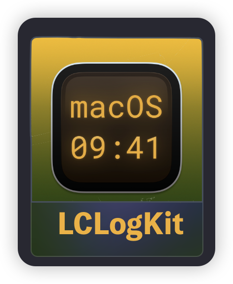
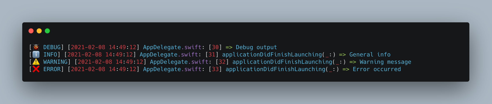

<p align="center">


<p align="center"> <b> LCLogKit is a lightweight Swift logger!</b></p>

<p align="center">


<a href="https://twitter.com/LiuChuan_"></a>
</p>

---

> [中文](README_CN.md) | [English](README.md)


## How to use

- Debug output, do not show method names

```swift
LCLogKit.debug("Debug output", showFunction: false)
```

- Normal output information

```swift
LCLogKit.info("General info")
```

- Warning output information

```swift
LCLogKit.warning("Warning message")
```

- Error output information

```swift
LCLogKit.error("Error occurred")
```


        
## Preview
        


## Installation

### CocoaPods
LCLogKit is available through [CocoaPods](https://cocoapods.org). To install it, simply add the following line to your Podfile:


```swift
pod 'LCLogKit'
```


### SwiftPackage

Add `https://github.com/DevLiuSir/LCLogKit.git` in the [“Swift Package Manager” tab in Xcode](https://developer.apple.com/documentation/xcode/adding_package_dependencies_to_your_app).


## License

MIT License

Copyright (c) 2024 Marvin


## Author

| [](https://github.com/DevLiuSir)  |  [DevLiuSir](https://github.com/DevLiuSir)<br/><br/><sub>Software Engineer</sub><br/> [][1] [][2] [][3]|
| :------------: | :------------: |

[1]: https://twitter.com/LiuChuan_
[2]: https://github.com/DevLiuSir
[3]: https://devliusir.com/

        
        