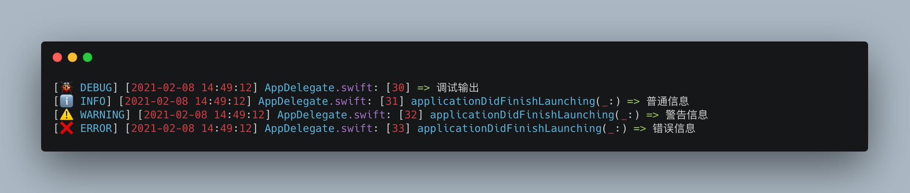

<p align="center">


<p align="center"> <b> LCLogger 是一款轻量级的 Swift 日志记录器！</b></p>

<p align="center">


<a href="https://twitter.com/LiuChuan_"></a>
</p>

---

> [中文](README_CN.md) | [English](README.md)


## 如何使用

- 调试输出，不显示方法名称

```swift
LCLogKit.debug("调试输出", showFunction: false)
```

- 普通输出信息

```swift
LCLogKit.info("普通信息")
```

- 警告输出信息

```swift
LCLogKit.warning("警告信息")
```

- 错误输出信息

```swift
LCLogKit.error("错误信息")
```


## 预览



## 安装

### CocoaPods
LCLogKit 可通过 [CocoaPods](https://cocoapods.org) 获取。要安装它，只需将以下行添加到您的 Podfile 中：


```swift
pod 'LCLogKit'
```


### SwiftPackage

添加 `https://github.com/DevLiuSir/LCLogKit.git`  [Xcode 中的“Swift Package Manager”选项卡](https://developer.apple.com/documentation/xcode/adding_package_dependencies_to_your_app).


## 许可证

MIT License

Copyright (c) 2024 Marvin


## 作者

| [](https://github.com/DevLiuSir)  |  [DevLiuSir](https://github.com/DevLiuSir)<br/><br/><sub>Software Engineer</sub><br/> [][1] [][2] [][3]|
| :------------: | :------------: |

[1]: https://twitter.com/LiuChuan_
[2]: https://github.com/DevLiuSir
[3]: https://devliusir.com/

        
        